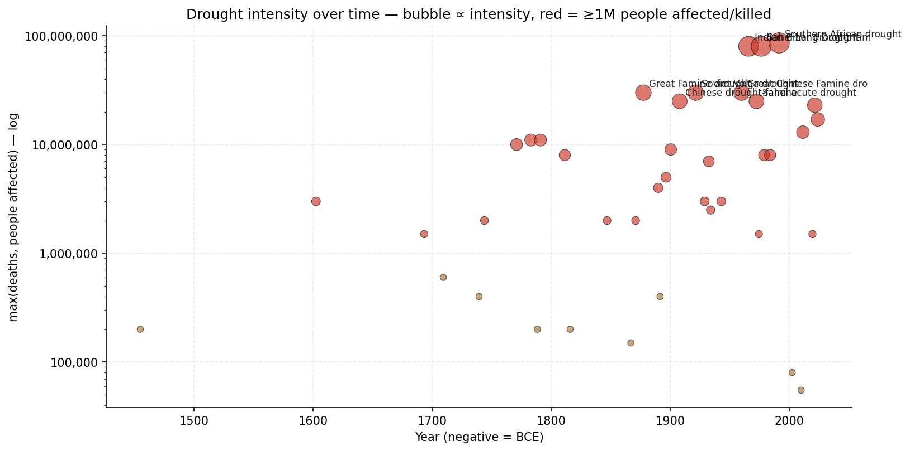
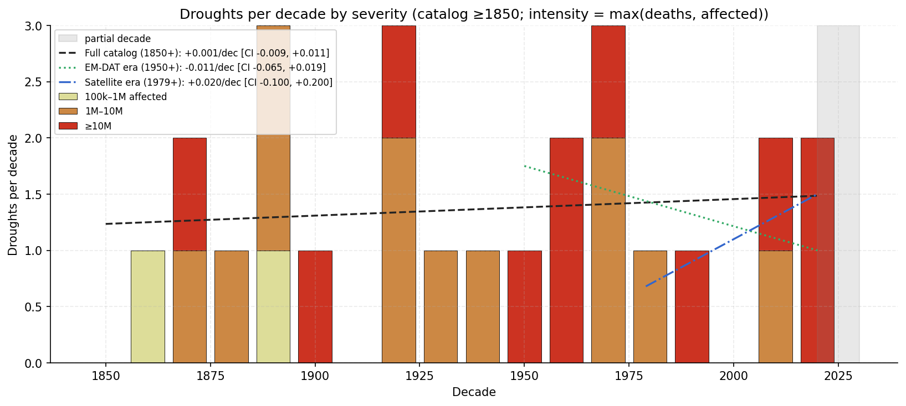
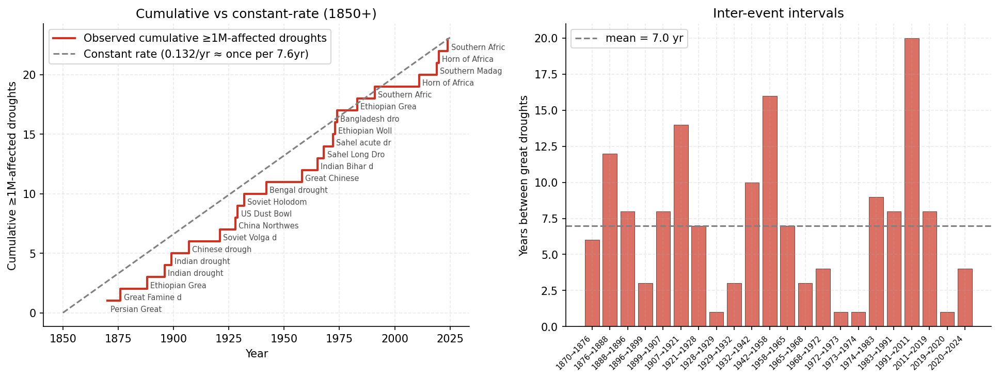
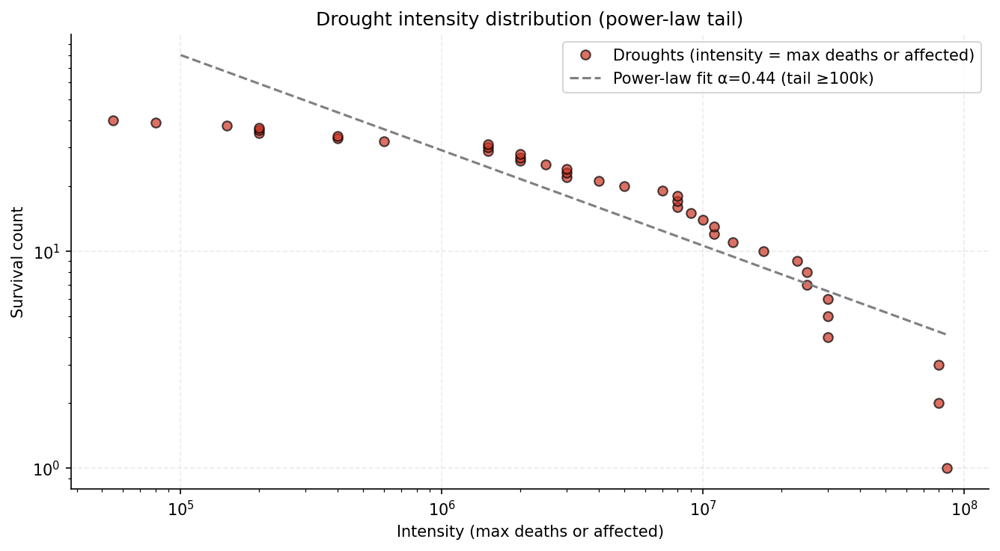

# droughts-tracking

Hand-curated catalog of major historical droughts from the 4.2-kiloyear event (~2200 BCE) to present.

Parallel to `earthquakes`, `spaceweather`, `famines-tracking`, `flood-data`, `pandemics-tracking`, `volcanic-eruptions`, `tropical-cyclones`, `astronomical-signs`.

## Quick findings

- **~65 events catalogued**; 23 with ≥1M people affected or killed.
- **The 1876–1879 Great Famine drought is the deadliest single event in recorded history**: an estimated 30 million deaths across India, China, Brazil, and Egypt during an extreme El Niño event. Mike Davis called it "the worst event in human history not attributed to war or epidemic."
- **The Sahel long drought (1968–1985)** displaced ~80 million people across the West African Sahel — comparable to the population of Germany at the time. Multi-decade desertification.
- **Modern droughts kill far fewer people but displace more.** The Horn of Africa 2020–23 drought killed ~43,000 directly but affected 23 million people. Modern food distribution and aid have largely uncoupled "drought" from "mass mortality" for droughts of the same meteorological severity.
- **No clear acceleration in the satellite-era count** of ≥1M-affected events, but post-1950 frequency is markedly higher than pre-1950 — at least partly a detection/recording effect.

## Sample output

### Drought intensity over time

Each circle is one drought; the y-axis is "max(deaths, people affected)" on a log scale, and red highlights events that affected ≥1 million people. The Great Famine drought of 1876–79 and the Sahel long drought sit at the very top; the modern era is dense with mid-tier events.

**In plain English:** Each dot is one drought event. Higher up = more devastating. The y-axis uses log scale (1k → 10k → 100k → 1M etc.) because pre-1900 droughts were measured mainly by their death tolls while modern droughts are measured by how many people they affected — both numbers span huge ranges. Red circles are events that crossed the million-person threshold one way or the other.



### Droughts per decade by intensity band

Stacked bars: droughts per decade since 1850 by intensity band (100k–1M affected, 1M–10M, ≥10M). Three trend lines fitted to different monitoring eras (full 1850+, EM-DAT era 1950+, satellite era 1979+) with bootstrap 95% CIs.

**In plain English:** Each bar shows how many notable droughts occurred in a 10-year period, stacked by how big they were. The three dashed lines are trend fits for different monitoring eras: full record (1850+), EM-DAT-era (1950+, when international tracking began), and satellite era (1979+, when full global coverage came online). If droughts were getting more frequent for real, the trend would be steeper in the tighter eras. If it's mostly catalog improvement, the trends would shrink in tighter eras.

**Above vs. below the trend lines:** A decade whose bar exceeds the trend line for an era had more droughts than the era's average; below the line means fewer. The 1870s–1880s bars rise above the full-catalog line (big Indian famine-droughts), while the 1920s–1940s bars sit below — fewer catalogued droughts in the WWII-era catalog, which may be partly real and partly because famines from that period got logged as famines, not droughts.



### Great drought timing (≥1M affected)

Cumulative count of ≥1M-affected droughts since 1850 vs a constant-rate reference, plus inter-event intervals.

**In plain English:** Left panel: the grey dashed line is "what we'd see if big droughts hit on a perfectly steady clock." The red staircase is when ≥1M-affected events actually happened. **Above vs. below the line:** when the staircase is *above* the dashed reference, big droughts have been arriving *faster* than the long-run average; *below* means they've been arriving *slower*. The catalog spends extended periods above (1870s–early 1900s with the great Indian/Chinese famine-droughts) and below (mid-20th-C). Right panel: years between each big drought and the next one. Bigger bars = longer quiet periods.



### Intensity distribution

Log-log survival function with power-law fit on the ≥100k tail.

**In plain English:** Reading the dots right to left: the further right, the bigger the drought; the lower a dot, the rarer events at that level are. The dashed line shows the predictable pattern that connects "small common droughts" to "rare huge ones." Earthquakes, famines, wars, and floods all follow similar tails — this is the universal "fat-tail" pattern of rare extreme events.

**Above vs. below the line:** A dot *above* the dashed power-law fit means more droughts at that intensity than the scaling rule predicts — an excess of that severity in the catalog. A dot *below* the line means fewer than predicted. The 1876 Great Famine drought (30M deaths) and the Sahel long drought (80M affected) sit at the far right of the chart, and whether they fall above or below the line determines whether the very-worst events are "even worse than the fit predicts" (super-fat-tail) or "still within scaling." In this catalog they land roughly on the line — meaning even the catastrophic events follow the same predictable rule.



## What's in it

`droughts.csv` — ~65 events with columns:

- `start_year`, `end_year` — duration (multi-year droughts are typical)
- `name` — common scholarly designation
- `region`
- `deaths_estimate` — usually 0 for modern droughts (food aid reduces mortality); meaningful for pre-1950 famine-droughts
- `people_affected` — primary modern intensity measure (displaced + food-insecure population)
- `sources_notes` — primary source/citation

Coverage: 4.2 kiloyear event (~2200 BCE) → 2024 Southern Africa drought. Includes:

- Bronze Age + Mayan + Anasazi paleoclimate events (deaths unknown, listed as research index)
- 18th–19th C Indian drought-famines (1769 Bengal, 1782 Chalisa, 1791 Doji bara, 1876 Great Famine, 1899 Indian famine)
- 20th C iconic events (Dust Bowl, Soviet Volga 1921, Great Chinese Famine 1958–62, Sahel long drought, Ethiopian 1983–85)
- 21st C events (Millennium Drought Australia, California 2012–17, Horn of Africa 2011 + 2020–23, European 2018/2022, Amazon 2023–24)

## Detection-bias notes

| Era | Coverage |
|---|---|
| Pre-1500 | Paleoclimate (tree rings, sediment) + civilization-collapse records only; deaths usually unknown |
| 1500–1850 | Major famines documented in colonial trade and royal records; regional/non-Western droughts undercounted |
| 1850–1950 | Meteorological services improving; major regional events tracked |
| 1950–present | EM-DAT and FAO tracking; near-complete for events with significant human impact |
| 1979–present | Satellite drought monitoring (PDSI, MODIS, SPI); complete for any drought visible from orbit |

Death attribution is fuzzy for drought because most deaths are from secondary famine and disease rather than the drought itself. The catalog uses scholarly midpoint estimates where they exist; where they don't, only people-affected is given. Where neither exists (paleoclimate events), the row is kept as research context.

## Reproducing the plots

```bash
python3 -m venv .venv
.venv/bin/pip install pandas numpy matplotlib
.venv/bin/python make_plots.py
```

## Sources

- Davis, M. (2001). *Late Victorian Holocausts: El Niño Famines and the Making of the Third World.*
- Ó Gráda, C. (2009). *Famine: A Short History.*
- Hodell, D. A. et al. (2001). *Solar Forcing of Drought Frequency in the Maya Lowlands.* Science.
- Cullen, H. M. et al. (2000). *Climate change and the collapse of the Akkadian empire.* Geology.
- Kaniewski, D. et al. (2013). *Environmental Roots of the Late Bronze Age Crisis.* PLOS One.
- Pankhurst, R. (1985). *The History of Famine and Epidemics in Ethiopia.*
- de Waal, A. (2017). *Mass Starvation: The History and Future of Famine.*
- World Peace Foundation Mass Atrocity Endings dataset
- EM-DAT (CRED, UC Louvain) Disaster Database
- FAO/GIEWS — Global Information and Early Warning System
- Our World in Data drought/famine tracker

Death-toll estimates differ widely across sources for pre-1950 events; this CSV uses scholarly midpoints. For active research consult the published references.

## Intended use

This repo is the data source for the drought correlation tests in [`Biblejustin/correlations`](https://github.com/Biblejustin/correlations).
